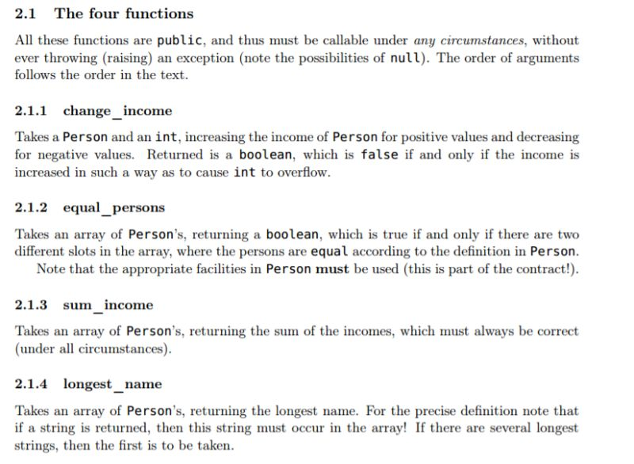
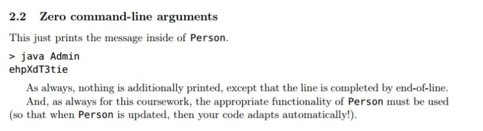
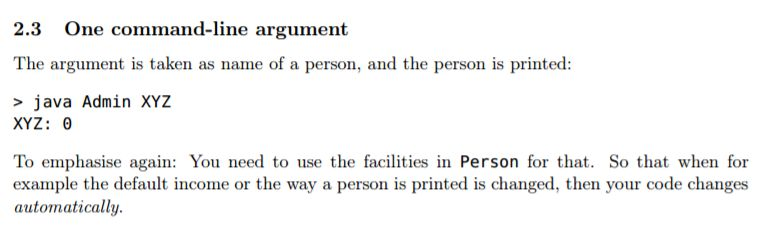
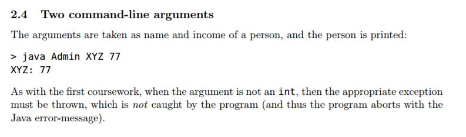
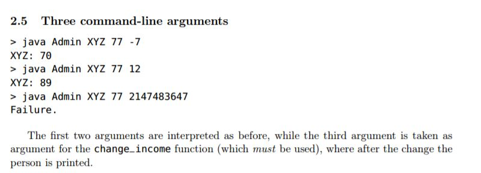
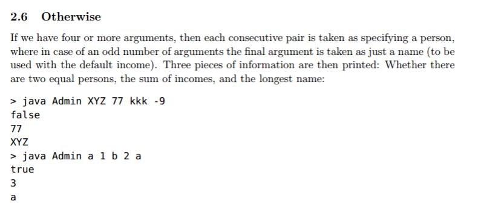
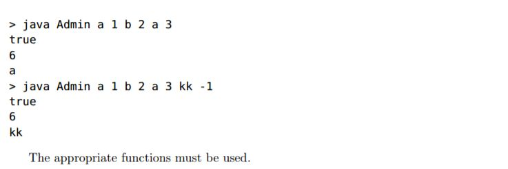

## Q















## A

用 IntelliJ IDEA 打开导入 maven 工程，或者命令行下 `make`，如下：

```
mvn package
[INFO] Scanning for projects...
[INFO]
[INFO] ------------------------------------------------------------------------
[INFO] Building zjbrohw 1.0-SNAPSHOT
[INFO] ------------------------------------------------------------------------
[INFO]
[INFO] --- maven-resources-plugin:2.6:resources (default-resources) @ zjbrohw ---
[INFO] Using 'UTF-8' encoding to copy filtered resources.
[INFO] skip non existing resourceDirectory D:\tzx\git\zjbrohw\src\main\resources
[INFO]
[INFO] --- maven-compiler-plugin:2.3.2:compile (default-compile) @ zjbrohw ---
[INFO] Compiling 2 source files to D:\tzx\git\zjbrohw\target\classes
[INFO]
[INFO] --- maven-resources-plugin:2.6:testResources (default-testResources) @ zjbrohw ---
[INFO] Using 'UTF-8' encoding to copy filtered resources.
[INFO] skip non existing resourceDirectory D:\tzx\git\zjbrohw\src\test\resources
[INFO]
[INFO] --- maven-compiler-plugin:2.3.2:testCompile (default-testCompile) @ zjbrohw ---
[INFO] No sources to compile
[INFO]
[INFO] --- maven-surefire-plugin:2.10:test (default-test) @ zjbrohw ---
[INFO] No tests to run.
[INFO] Surefire report directory: D:\tzx\git\zjbrohw\target\surefire-reports

-------------------------------------------------------
 T E S T S
-------------------------------------------------------

Results :

Tests run: 0, Failures: 0, Errors: 0, Skipped: 0

[INFO]
[INFO] --- maven-jar-plugin:3.0.2:jar (default-jar) @ zjbrohw ---
[INFO] Building jar: D:\tzx\git\zjbrohw\target\zjbrohw.jar
[INFO]
[INFO] --- maven-shade-plugin:2.4.1:shade (default) @ zjbrohw ---
[INFO] Replacing original artifact with shaded artifact.
[INFO] Replacing D:\tzx\git\zjbrohw\target\zjbrohw.jar with D:\tzx\git\zjbrohw\target\zjbrohw-1.0-SNAPSHOT-shaded.jar
[INFO] ------------------------------------------------------------------------
[INFO] BUILD SUCCESS
[INFO] ------------------------------------------------------------------------
[INFO] Total time: 2.545s
[INFO] Finished at: Wed Dec 07 22:38:12 CST 2016
[INFO] Final Memory: 16M/236M
[INFO] ------------------------------------------------------------------------
sh ./test.sh
No args
%%% java -jar target/zjbrohw.jar
Usage: java Admin <NAME> <INCOME>

One arg: Admin
%%% java -jar target/zjbrohw.jar Admin
ephXdT3tie
One arg: not Admin
%%% java -jar target/zjbrohw.jar XXX
ERROR: You are not an Admin.
two args: Admin, name
%%% java -jar target/zjbrohw.jar Admin XYZ
XYZ: 0

three args: Admin, name, income
%%% java -jar target/zjbrohw.jar Admin XYZ 77
XYZ: 77

four args: Admin, name, income, delta
%%% java -jar target/zjbrohw.jar Admin XYZ 77 -7
XYZ: 70
%%% java -jar target/zjbrohw.jar Admin XYZ 77 12
XYZ: 89
%%% java -jar target/zjbrohw.jar Admin XYZ 77 2147483647
Failure.

more than four args: Admin, [{name, income}], ...
%%% java -jar target/zjbrohw.jar Admin XYZ 77 kkk -9
false
77
XYZ
%%% java -jar target/zjbrohw.jar Admin a 1 b 2 a
false
3
a
%%% java -jar target/zjbrohw.jar Admin a 1 b 2 a 3
true
6
a
%%% java -jar target/zjbrohw.jar Admin a 1 b 2 a 3 kk -1
true
6
kk
```
